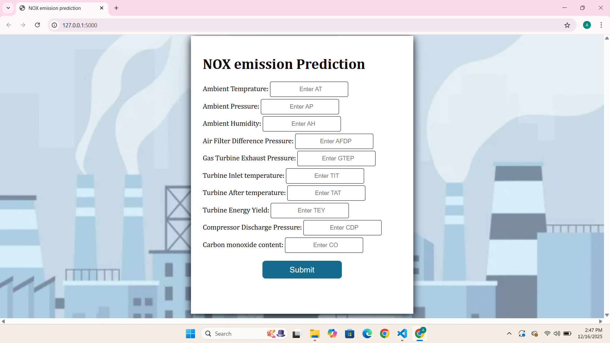
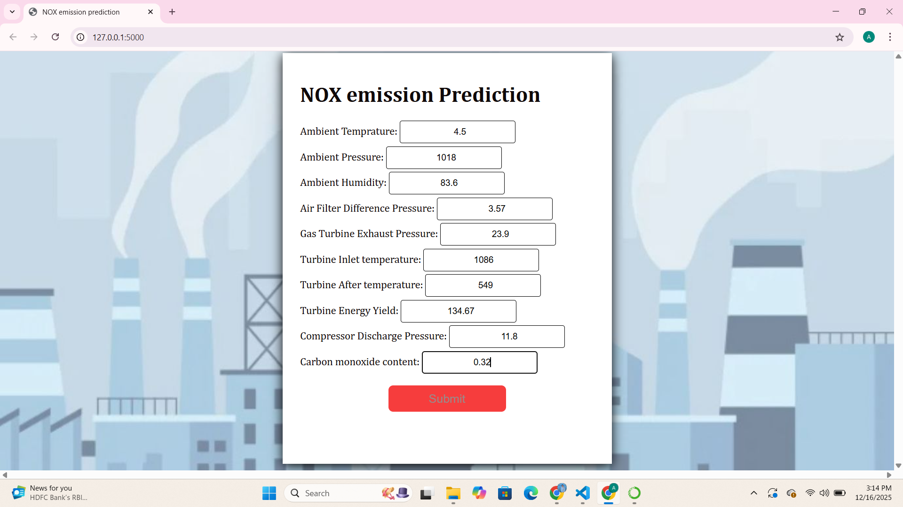
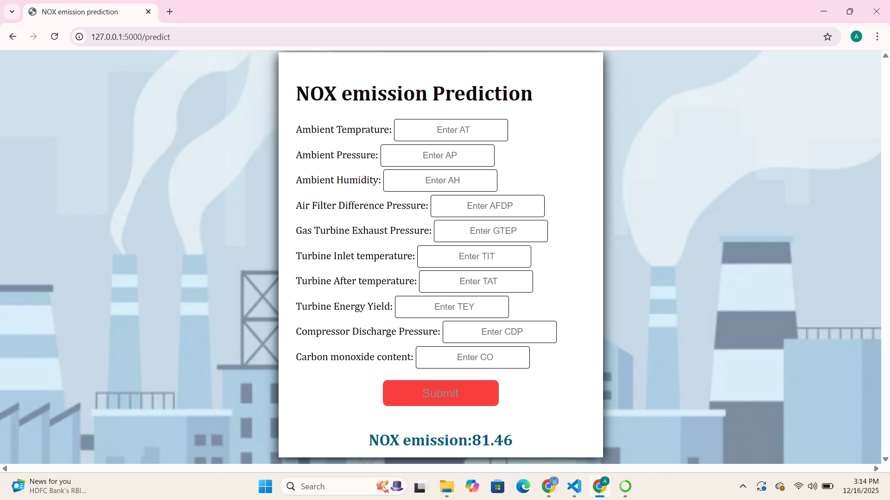

# Project Title : Predicting Energy NOX emission of a Gas Turbine

# Objective :

The datset has attributes such as atmospheric temperature, ambient pressure, ambient humidity, gas turbine inlet and exhaust pressures, and much more. This dataset has readings taken from various sensors in years from 2011 to 2015.The dataset contains information of a gas turbine located in Turkey. This project is going to measure Nitrogen oxide emission of gas turbine by using NOX as target variable.

# Dataset Used : 

The dataset used for this project was taken from the UCI machine learning repository :https://archive.ics.uci.edu/dataset/551/gas+turbine+co+and+nox+emission+data+set

## Phase 1: EDA and Data Pre-processing

**Preprocess and Cleaning**

- Checking for any irrelevant features in the dataset and dropping them.

- Checking for null / missing values.

- Check for different data types.

**Exploratory Data Analysis through Visualisation**

 Then use various graphs to understand the data better.

 - Histplot
   
 - Pairplot
   
 - Scatter Plot

 - Boxplot (Handle outliers)

 - Heatmap

## Phase 2: Feature Selection and Model Building

 ## **Models Used:**
 
   - Linear Regression

   - Decision Tree

   - Random Forest

   - Gradient Boosting Regressor

   - KNN
     
Based on model evaluation metrics, Random Forest outperformed the other models, achieving the best overall predictive performance, indicating it is the most suitable model for this dataset.

## Key Results

 Random Forest Regression model has R2 score of 0.885711659269566, also the plot of learning curve showsthe most stable and good fit. Based on that, it used for the Gas Turbine NOX emission prediction project.

# Model Output Preview

## *NOTE:*
- Trained model files (.pkl) are excluded due to size limits.
Run model.py to regenerate the model.

- Jupyter notebook file can not load due to size limit.
Download miniproject1.ipynp file to get **EDA, Data Pre-processing and Model Building**.

## Requirements

- Python 3.10+

- Flask

- Pandas

- NumPy

- Scikit-learn

- Random Forest Regression Model

- HTML,CSS

**Name:** Anamika Suresh

**Title of ML project:**  Predicting Energy NOX emission of a Gas Turbine

**Organization :**  Entri Elevate

